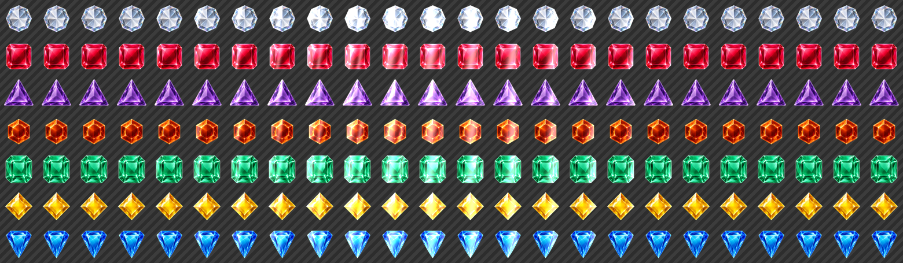
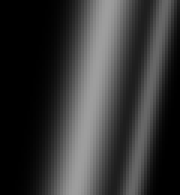
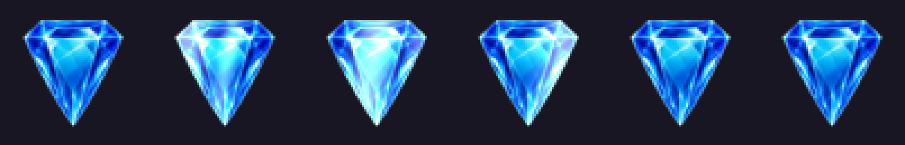

# GemShine hoạt động thế nào

Giải thích hiệu ứng "vệt sáng quét ngang viên gem" trong `include/GemShine.h` +
`src/GemShine.cpp`. Viết ra vì cơ chế của nó không hiển nhiên khi đọc code, và
vì nó là lý do gem **không được vẽ ra từ atlas** — điều ảnh hưởng trực tiếp tới
draw call (xem [Hệ quả với batching](#hệ-quả-với-batching)).

> Ảnh trong doc này sinh bằng `docs/images/gemshine_figures.py` — script chép
> lại đúng công thức trong `GemShine.cpp` rồi đọc gem sprite thật từ
> `media/atlas.png`. Sửa hằng số trong `GemShine.cpp` thì chạy lại script,
> nếu không ảnh sẽ lệch khỏi code.

## Vấn đề cần giải

Muốn có vệt sáng lướt qua mặt gem như thuỷ tinh đánh bóng. Cách ngây thơ là
mỗi frame vẽ một hình chữ nhật gradient đè lên gem — nhưng **gem không lấp đầy
ô 65×65**, nên vệt sáng sẽ tràn ra ngoài viền và đọng trên nền bàn cờ, trông
như một mảng sáng lơ lửng.

Muốn cắt vệt sáng theo đúng hình dáng gem thì phải mask. Làm mask mỗi frame,
cho 64 ô, là quá đắt.

## Cách giải: pre-render toàn bộ

`GemShine::bake()` dựng sẵn **một sprite sheet** lúc load:

```
1560 × 455 = (24 frame × 65px) × (7 màu gem × 65px)
```

Mỗi ô = **gem + vệt sáng ở một vị trí cố định**. Vòng lặp (`GemShine.cpp:177-194`)
chỉ làm đúng 2 lệnh vẽ mỗi ô:

```cpp
SDL_RenderCopy(renderer, gemTexture, &gemSrc, &cell);    // 1. gem lấy từ atlas
SDL_RenderCopy(renderer, streak, nullptr, &streakRect);  // 2. vệt sáng đè lên
```

Toàn bộ được render vào một texture riêng qua `SDL_SetRenderTarget`
(`:119` tạo texture, `:148` set target).



*Sheet thật `bake()` tạo ra, nền carô = vùng trong suốt. 7 hàng (mỗi màu gem),
24 cột (các bước của vệt sáng). Cột ngoài cùng bên trái là frame 0.*

## Vệt sáng không phải file ảnh

`createStreakTexture()` (`:45`) **sinh nó bằng công thức**, không load từ đâu
cả: hai dải gaussian cộng lại — một dải rộng và mờ (`sigma=9`, đỉnh `0.62`) cộng
một dải hẹp và gắt bám sau nó (`sigma=4`, đỉnh `0.40`, lệch `19px`). Chính dải
hẹp thứ hai tạo cảm giác "mặt kính bóng" chứ không phải vệt mờ chung chung.

Cả hai nghiêng 80° so với phương ngang, qua `streakLean()`.



*Texture vệt sáng, 60×65, phóng 3×. Đây là thứ được đè lên gem ở bước 2.*

Kích thước `60px` rộng hơn cần thiết là có chủ đích: vệt phải đi được từ **hoàn
toàn ngoài mép trái** tới **hoàn toàn ngoài mép phải** của ô 65px.

## Chỗ khéo nhất: blend mode

Đây là mấu chốt. `maskedAdditiveBlend()` (`:98`):

```cpp
SDL_ComposeCustomBlendMode(
    SDL_BLENDFACTOR_DST_ALPHA, SDL_BLENDFACTOR_ONE, SDL_BLENDOPERATION_ADD,
    SDL_BLENDFACTOR_ZERO,      SDL_BLENDFACTOR_ONE, SDL_BLENDOPERATION_ADD);
```

Nghĩa là:

```
colour = streak × dstAlpha + colour
alpha  = alpha                          (giữ nguyên)
```

`dstAlpha` chính là **alpha của gem** tại pixel đó, vì gem đã được vẽ vào target
trước. Nên:

| Vị trí pixel | `dstAlpha` | Kết quả |
|---|---|---|
| Trong thân gem | 1.0 | Cộng đủ độ sáng |
| Rìa gem (anti-alias) | 0…1 | Sáng mờ dần, khớp đúng độ mờ của viền |
| Ngoài viền gem | 0 | `streak × 0` → **không cộng gì** |

Vệt sáng tự bị cắt theo silhouette của gem, **không cần stencil, không cần pass
phụ**. Và vì `alpha = alpha`, độ trong suốt của gem không bị vệt sáng làm hỏng.

Đây cũng là lý do độ sáng được nhét vào **kênh RGB chứ không phải alpha**
(comment `:38-44`): hệ số blend là `DST_ALPHA` chứ không phải `SRC_ALPHA`, nên
alpha của chính vệt sáng không bao giờ đi vào phương trình màu — nếu để độ sáng
ở alpha thì nó bị bỏ qua hoàn toàn.



*Frame 0, 8, 11, 14, 17, 23 phóng 4×. Vệt sáng quét qua nhưng luôn nằm gọn
trong viền gem — không có mảng sáng nào tràn ra nền.*

## Frame 0 là gem sạch

Vị trí vệt sáng theo frame (`:188-190`):

```cpp
double travel = double(frame) / (kFrameCount - 1);
int streakX = cell.x - kStreakWidth
            + static_cast<int>((kCellSize + kStreakWidth) * travel);
```

Ở `frame = 0`, `travel = 0` nên `streakX = cell.x - 60` — vệt nằm **hoàn toàn
bên trái ngoài ô**, và bị `SDL_RenderSetClipRect(&cell)` (`:182`) cắt sạch.

Nên **frame 0 = gem nguyên bản, không có vệt sáng**. Đó là frame dùng khi gem
đứng yên, tức là gần như toàn bộ thời gian chơi. `attach()` cũng set frame 0
làm mặc định (`:225`).

Clip rect còn bắt buộc vì lý do khác: vệt sáng rộng 60px thò ra ngoài ô, không
clip thì nó lem sang ô bên cạnh **trong chính sheet**.


*Nguyên một hàng của gem xanh, 24 frame liên tiếp — đúng cách chúng nằm cạnh
nhau trong sheet.*

## Lúc chạy game tốn gì?

**Gần như không.** `setFrame()` (`:228`) chỉ đổi source rect:

```cpp
SDL_Rect cell = {frame * kCellSize, gem * kCellSize, kCellSize, kCellSize};
image.setSrcRect(cell);
```

Gem vẫn là **một quad như cũ**, chỉ trỏ sang ô khác trong sheet. Animate =
tăng chỉ số frame. Mọi chi phí composite đã trả một lần lúc load.

Đánh đổi là **VRAM**: sheet 1560×455 RGBA ≈ **2.8 MB**.

### Vệt sáng nghiêng để làm gì

`GameBoard` dùng `GemShine::streakLean()` để **lệch pha frame theo vị trí ô**:
ô ở hàng dưới được cho sáng trễ hơn đúng bằng độ nghiêng của vệt. Nhờ vậy cả
bàn cờ trông như có **một đường sáng thẳng duy nhất** quét chéo qua, thay vì 64
viên gem nhấp nháy độc lập. Cả góc nghiêng của vệt trong từng ô lẫn độ trễ giữa
các ô đều suy ra từ cùng một hằng số `kStreakAngleDegrees`, nên hai thứ luôn
khớp góc với nhau.

Hiệu ứng chỉ chạy khi bàn cờ đứng yên (`mState == eSteady || eGemSelected`) —
lúc đang swap hoặc cascade thì gem đã đủ hút mắt rồi.

## Hệ quả với batching

Đây là phần dễ hiểu nhầm nhất.

**Art của gem CÓ nằm trong atlas** (`Assets::Sprite::GemBlue` = `"gemBlue.png"`,
có trong `atlas.json`). `GameBoard::loadResources()` nạp gem từ atlas thật
(`GameBoard.cpp:119-125`).

**Nhưng gem không được vẽ ra từ atlas.** Ngay sau đó (`GameBoard.cpp:131-139`):

```cpp
if (mGemShine.bake(mGame, atlas))          // đọc gem RA KHỎI atlas để bake
{
    mGemShine.attach(mImgWhite, GemShine::White);   // rồi GHI ĐÈ
```

và `attach()` (`GemShine.cpp:224`) thay nguyên cái Image:

```cpp
image = GoSDL::Image(mSheet);
```

Từ lúc đó, `mImgWhite`… trỏ sang `mSheet`. Atlas chỉ đóng vai trò **nguyên
liệu lúc bake**.

Nên trong màn game có **3 texture**: `board.png`, sheet của GemShine, và atlas
dùng chung. Đó là lý do `Z::Gem` phải nằm **ngoài** dải z của atlas — chi tiết
trong comment đầu `include/ZOrder.h` và
[step5-bitmap-font-atlas-report.md](step5-bitmap-font-atlas-report.md).

Nếu muốn gộp gem về chung batch với atlas thì phải pack cái sheet 1560×455 này
vào chính atlas — nhưng atlas hiện đã 1297×512, cộng thêm sẽ vượt giới hạn
2048, nên phải giảm `kFrameCount` hoặc đổi cách tiếp cận.

### Nhánh fallback

Nếu `bake()` fail (`SDL_CreateTexture` lỗi, hoặc backend từ chối custom blend
mode) thì `attach()` là no-op và gem **giữ nguyên Image từ atlas** — mất hiệu
ứng shine, nhưng bù lại gem gộp chung batch với atlas. Code xử lý sẵn: `:138-145`
còn có fallback trung gian là `SDL_BLENDMODE_ADD` thường, chấp nhận vệt sáng lem
ra ngoài viền gem.
