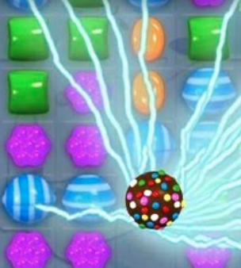
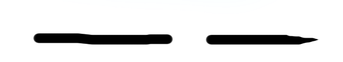
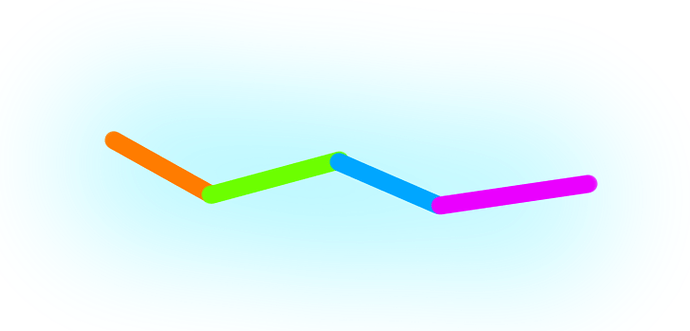

# Candy Crush Lightning Strike Effect
Url: https://forum.defold.com/t/candy-crush-lightning-strike-effect/67561

# Question:
How can i make lightning effect like link below? Shader or animation?

# Answer from Defold's staff:
One way is with sprites only. You have lightning segments (with some random variation) and soft circular glow textures which you draw together.

Think about this image where every color is a random variation. Then with start/end segments you would have the edge taper off.

For connecting / generating the segments you have a start and end position and pick some random variation for the connection points of the segments toward the final position with the final positioning exactly pointing at the end position.

# Reply to Defold's staff:
Thank you for the answer.

You mean snake style. Join head, body, tale in the tile?

https://github.com/HelloWorldSweden/Defold-Snake

# Phân tích chi tiết câu trả lời của Defold's staff

Bóc tách lại kỹ thuật "segment chain" mà staff mô tả thành các bước cụ thể:

1. **Xác định điểm đầu/cuối**: ví dụ 2 viên kẹo bị nối bởi lightning — có 1 start position và 1 end position cố định.
2. **Chia đoạn (segments)**: chia đường thẳng nối 2 điểm thành N đoạn nhỏ (N tùy độ dài/độ chi tiết mong muốn).
3. **Random jitter theo phương vuông góc**: với mỗi điểm nối giữa 2 đoạn liên tiếp, offset ngẫu nhiên theo phương vuông góc (perpendicular) với hướng chính của tia sét — đây chính là thứ tạo ra dáng "zigzag" đặc trưng, chứ không phải random hoàn toàn theo mọi hướng. Random toàn hướng sẽ ra hình răng cưa lộn xộn, không giống sét.
4. **Điểm cuối cố định**: dù các điểm giữa có random, điểm cuối luôn được ép về đúng vị trí end position — nghĩa là đoạn cuối cùng luôn "chỉ thẳng" vào đích, không random. Đây là chi tiết dễ bị bỏ sót nhưng quan trọng để tia sét trông có chủ đích thay vì trôi tự do.
5. **Vẽ từng đoạn bằng sprite thon dài**: mỗi segment là 1 sprite (quad dài, hẹp), xoay theo đúng góc của đoạn đó (tính từ 2 điểm đầu-cuối segment). Đầu và đuôi toàn bộ chain dùng sprite/texture riêng có texture taper (thon nhỏ dần) để tia sét không bị cắt cụt ở 2 đầu.
6. **Glow texture**: chồng thêm texture tròn mềm (soft circular glow, thường additive blend) tại các điểm nối giữa 2 segment — vừa che mối nối (segment thường không nối liền mạch 100% do góc xoay khác nhau), vừa tạo cảm giác phát sáng.
7. **Random variation về màu**: staff nhấn mạnh "every color is a random variation" trong ảnh demo — tức mỗi segment có thể lệch màu/độ sáng nhẹ so với segment kế bên, tạo cảm giác điện chớp không đều thay vì 1 khối màu đồng nhất.

**Nhận xét**: đây thực chất là một dạng đơn giản hóa của "midpoint displacement" (kỹ thuật sinh địa hình fractal / đường bờ biển) — áp dụng đệ quy 1 cấp (chia đều N đoạn + jitter) thay vì đệ quy nhiều cấp. Vì lightning bolt trong game chỉ cần "đủ giống" trong một khung hình nhỏ và thời gian ngắn, không cần độ chi tiết fractal thật sự, nên cách làm đơn giản này là đánh đổi hợp lý giữa chất lượng thị giác và chi phí tính toán — khớp với nhận định ở phần so sánh performance bên dưới rằng cách này rẻ và dễ throttle.

Điểm chưa rõ trong câu trả lời gốc: staff không nói rõ N (số segment) nên chọn bao nhiêu, hay tần suất regenerate random offset (mỗi frame hay mỗi vài frame) — đây là 2 tham số cần tự thử nghiệm/tune khi implement.

# Other question and answer on stackoverflow (maybe not related to game):

https://gamedev.stackexchange.com/questions/71397/how-can-i-generate-a-lightning-bolt-effect

# Research thêm (2026-07-23)

Đã search thử xem Slay the Spire / Vampire Survivors có tài liệu chính thức nào (dev blog, GDC talk) nói về cách họ render lightning không — **không tìm thấy**. Không có nguồn nào xác nhận 2 game này dùng kỹ thuật cụ thể nào, nên bỏ qua giả định trước đó.

Tìm được thêm các nguồn kỹ thuật chung (không riêng game nào):
- https://jettelly.com/blog/building-a-lightning-shader-in-unity-using-a-single-material — dùng ray marching + Posterize node để bẻ gradient mượt thành hình răng cưa giống sét thật, đẩy màu vượt ngưỡng HDR (>1.0) để trigger bloom tự động ở viền.
- https://github.com/keijiro/SpektrLightning — Unity line/shader renderer vẽ bolt giữa 2 điểm, khuyến nghị kết hợp HDR bloom.
- https://github.com/nullsoftware/UnityLightning

## So sánh performance: sprite-based vs shader-based

**Sprite-based (segment + sprite, theo Defold forum ở trên) — thường nhanh hơn, hợp cho mobile/2D:**
- Chỉ là quad + texture bình thường → tận dụng batching/instancing chung với các sprite khác.
- Không cần shader riêng, không cần render pass phụ (không HDR buffer, không bloom pass).
- Chi phí chủ yếu ở CPU (tính vị trí segment) — rẻ, dễ throttle (update mỗi 2-4 frame thay vì mỗi frame để có hiệu ứng rung giật của điện).
- Cần chú ý gộp atlas/material để tránh tăng draw call khi nhiều segment.

**Shader-based (ray marching / posterize + bloom):**
- Ray marching trong fragment shader tốn GPU hơn đáng kể, đặc biệt trên GPU mobile (fill-rate bound).
- Cần thêm bloom/HDR post-process pass → thêm 1 full-screen pass, tốn bandwidth.
- Đổi lại cho hiệu ứng mượt/đẹp hơn ở độ phân giải cao, ít lặp pattern.

**Kết luận cho project này**: codebase đang ưu tiên giảm draw call (xem commit `optimize drawcall`, `optimize build size`), nên hướng sprite-based (dùng chung atlas/material với sprite khác) hợp hơn shader/bloom pass riêng.

## Danh sách texture cần có (asset còn thiếu)

Thuật toán (segment chain + jitter + deque) đã rõ, phần còn thiếu là art asset:

1. **Segment/body texture** — hình chữ nhật dài, hẹp, gradient sáng ở giữa mờ dần ra 2 mép cạnh (không phải mép đầu/cuối) để ghép nhiều đoạn cạnh nhau trông liền mạch. Nên có 1-2 biến thể để random giữa các đoạn.
2. **Cap/tip texture** (đầu và đuôi) — giống segment nhưng thon nhọn dần về 1 phía (taper), dùng ở điểm đầu/cuối của tia sét để không bị cắt cụt.
3. **Glow texture (soft circular)** — hình tròn mờ dần ra viền (radial gradient trắng/màu điện → alpha 0), additive blend, đặt tại mỗi điểm nối giữa 2 segment để che mối nối + tạo cảm giác phát sáng.
4. **(Tùy chọn) Impact/burst texture** — glow lớn hơn đặt tại điểm cuối (nơi tia sét chạm đích), tạo cảm giác "nổ" nhẹ khi chạm. Không bắt buộc.

Ghi chú: cả 4 texture nên làm dạng **grayscale + alpha**, không vẽ sẵn màu — màu tint áp qua code (sprite color tint) để dễ đổi màu theo loại lightning mà không cần nhiều file ảnh.

# Kỹ thuật #2: Mesh-stretch + render target (tham khảo, làm sau kỹ thuật #1)

Nguồn: https://defold.com/2024/03/14/Lightning-VFX/ , sample project https://github.com/FlexYourBrain/sample_LightningVFX (demo: https://flexyourbrain.itch.io/lightning-vfx)

Đây là kỹ thuật khác hẳn segment-chain — không random/jitter theo frame, mà dùng animation vẽ sẵn rồi kéo giãn:

1. **Art asset**: 1 sprite animation dọc, kích thước cố định 96×820px, 12 frame loop (pixel art, upscale nhẹ lúc export) — vẽ tay, không phải procedural.
2. **Render target**: capture animation này offscreen mỗi frame vào 1 render target RGBA (giữ alpha), dùng 2 predicate render riêng (`offscreen` để capture, `captured` để hiển thị).
3. **Mesh component**: 1 quad 2 triangle (6 vertex), thuộc tính `position` (float32×3) và `texcoord0` (float32×2). Vertex được cập nhật mỗi frame để "kéo giãn" quad này giữa 2 điểm neo (đầu/cuối tia sét), lấy vị trí qua `go.get_position()` — cho phép tia sét khóa (lock-on) vào mục tiêu di chuyển.
4. **Shader**: vertex/fragment cơ bản — vertex nhận position + texcoord0, fragment sample texture từ render target đã capture.
5. **Performance**: 4-15 draw call, build HTML5 nén ~2MB — khá nhẹ nhờ chỉ 1 mesh + 1 render target, không tốn nhiều draw call như nhiều segment rời.

**So với kỹ thuật #1 (segment-chain)**:
- Kỹ thuật #2 đơn giản hơn về code runtime (không cần tính N segment + random jitter mỗi frame) nhưng đòi hỏi artist vẽ 1 animation dài đẹp sẵn (12 frame, đúng tỉ lệ), và cần render target — codebase bejeweled hiện chưa có khái niệm render target/mesh component (engine tự viết SDL2, chỉ có `Image::draw` sprite-based, không có mesh/vertex buffer).
- Kỹ thuật #1 hợp hơn với hạ tầng draw hiện tại của bejeweled (đã hỗ trợ rotation/scale/alpha/tint qua `Image::draw`), nên làm trước. Kỹ thuật #2 có thể xem xét sau nếu muốn nâng cấp chất lượng và engine đã có/thêm được mesh + render target.

**Asset tham khảo đã tải về**: `docs/lightning-effect/reference-assets/technique2-flexyourbrain/` (12 frame `b1-b12.PNG` + 5 biến thể `small_bolts1-5.png`). Lưu ý license chưa rõ ràng (xem `SOURCE.md` trong thư mục đó) — chỉ dùng để tham khảo hình dáng/tỉ lệ khi tự vẽ lại, không dùng trực tiếp trong game.

# Implement thử nghiệm kỹ thuật #1: StateLightningTest

Đã dựng 1 test scene riêng (`include/StateLightningTest.h`, `src/StateLightningTest.cpp`) để thử trực quan thuật toán segment-chain, tách biệt hoàn toàn khỏi gameplay/`GameBoard`:

- **Cách vào scene**: boot thẳng vào `StateLightningTest` thay vì main menu qua compile define `SEAJEWELED_TEST_SCENE`, bật bằng cmake option `ENABLE_LIGHTNING_TEST_SCENE=ON` (mặc định OFF, không ảnh hưởng build thật). Xem `Game::Game()` (`src/Game.cpp`) và `CMakeLists.txt`.
- **Demo**: bắn 1 tia sét từ tâm màn hình (400,300) đến vị trí con trỏ chuột, đổi random jitter mỗi ~65ms (`ReshuffleIntervalFrames`) để tạo cảm giác rung điện.
- **Segment count động theo khoảng cách**: thay vì cố định N, số đoạn tính theo `round(length / TargetSegmentLengthPx)` (mặc định ~45px/đoạn), clamp `[MinSegmentCount=4, MaxSegmentCount=18]` — khoảng cách xa tự động có nhiều đoạn hơn thay vì kéo giãn ít đoạn.
- **Nhánh phụ (branch)**: 1-2 nhánh/lần reshuffle, mọc từ 1 điểm ngẫu nhiên trên chain chính, lệch hướng chính 25-65°, dài tối đa `BranchMaxLengthPx=70px` (chặn tuyệt đối, không tỉ lệ vô hạn theo độ dài chain chính), dùng tint tối/mờ hơn (alpha thấp) để không lấn át chain chính. Hiện `BranchSegmentCount` cố định = 3, chưa co giãn theo độ dài nhánh (có thể làm sau nếu cần).
- **Asset**: 5 texture procedural (Python + PIL/numpy, script ở scratchpad, chưa checkin vào repo) — `segment`, `cap`, `tip` (16×16), `glow` (12×12, hiện đang tắt), `impact` (20×20). Tất cả dạng grayscale + alpha, tint áp qua code (tham số `color` của `Image::draw`).

## Bài học quan trọng: thẩm mỹ phụ thuộc vào texture nhiều hơn thuật toán

Thuật toán segment-chain + jitter đúng như thiết kế nhưng lần đầu implement (texture 8×8, glow to/đậm) nhìn "kỳ" — như chuỗi hạt nối dây mảnh, không giống 1 tia sét liền mạch. Các nguyên nhân xác định được, theo thứ tự ảnh hưởng:

1. **Glow quá to/đậm so với thân segment** → mỗi khớp nổi bật thành 1 điểm riêng biệt thay vì làm mượt mối nối. Fix: giảm kích thước xuống còn ~1.3× độ dày thân, giảm alpha (200→110), vẫn chưa đủ đẹp.
2. **Segment không tự fade 2 đầu theo chiều dài** — texture gốc chỉ mềm theo chiều ngang (vuông góc hướng đi), 2 đầu trái/phải bị cắt phẳng tuyệt đối. Trong khi glow lại mềm đều mọi hướng → 2 phong cách edge khác nhau "choảng" nhau khi đặt cạnh nhau. Fix: cho segment/cap/tip tự fade ở 2 đầu theo chiều dài (trừ cạnh gốc thật của cap và mũi thật của tip — không cần fade vì không có gì để nối), rồi khi vẽ mỗi mảnh **overlap ~10px** vào mảnh kế bên (xem `drawBoltPiece()`, có tính `overlapStart`/`overlapEnd` theo loại sprite) để 2 vùng fade chồng lên nhau tái tạo độ sáng đầy đủ tại khớp — nhờ vậy có thể **tắt hẳn glow ở khớp** mà vẫn mượt.
3. **Texture filter (bilinear vs nearest)**: game set `SDL_HINT_RENDER_SCALE_QUALITY=1` (bilinear) toàn cục (`go_window.cpp:25`). Thử ép nearest riêng cho texture lightning qua `SDL_SetTextureScaleMode(texture, SDL_ScaleModeNearest)` (ghi đè per-texture, không đụng phần còn lại của game) — **kết quả tệ hơn**: texture vốn là gradient Gaussian liên tục lấy mẫu ở độ phân giải quá thấp (8×8, chỉ ~8 bậc alpha), nearest biến mỗi bậc thành khối vuông to, giống "mã vạch" hơn là pixel art. Kết luận: filter không phải nguyên nhân gốc, độ phân giải nguồn mới là vấn đề.
4. **Độ phân giải nguồn (resolution)**: tăng segment/cap/tip từ 8×8 lên **16×16** (giữ nguyên bilinear, giữ tỉ lệ sigma/fade như bản 8×8) cải thiện rõ rệt — gradient đủ mượt để blend tự nhiên. **Kết luận chung: với cách sinh texture bằng gradient liên tục (không phải pixel art vẽ tay thật), thẩm mỹ phụ thuộc chủ yếu vào (a) độ phân giải nguồn đủ lớn và (b) texture có fade/taper đúng chỗ để tự blend — thuật toán segment-chain chỉ là khung xương, không tự động "đẹp".**

## Thông số đã tune (state hiện tại, `StateLightningTest.h`)

- `ThicknessPx = 10`, `OverlapPx = 10`, `EDGE_FADE_FRAC = 0.28` (script gen texture).
- `TargetSegmentLengthPx = 45`, `MinSegmentCount = 4`, `MaxSegmentCount = 18`.
- `ReshuffleIntervalFrames = 4` (~65ms).
- Glow/impact đã wire vào code nhưng **glow ở khớp đang tắt** (comment trong `draw()`) vì overlap của segment/cap/tip đã đủ mượt; impact ở điểm cuối vẫn bật.
- Chưa làm: nhánh phụ co giãn segment count theo độ dài (đang cố định 3), thử độ phân giải > 16×16, checkin script Python gen texture vào repo (hiện ở scratchpad ngoài repo).